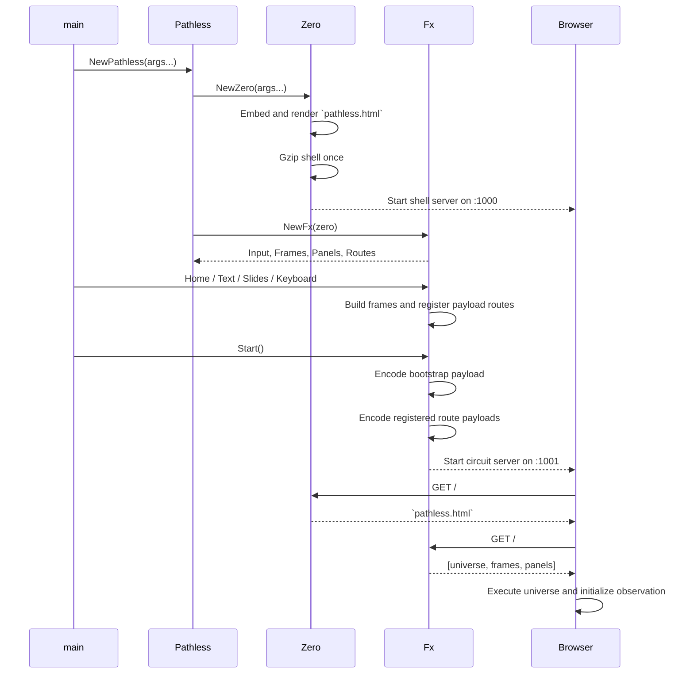

# Sequence

Pathless is constructed in two phases:

1. Establish the point of observation.
2. Register and serve the experience observed from it.

## Runtime sequence



## Composition

`Pathless` embeds `*fx.Fx`:

```go
type Pathless struct {
	*fx.Fx
}
```

`NewPathless` constructs `Zero` first, then gives it to `Fx`:

```go
func NewPathless(args ...string) *Pathless {
	z := zero.NewZero(args...)
	f := fx.NewFx(z)
	return &Pathless{Fx: f}
}
```

Because `Fx` is embedded, its exported methods are promoted onto `Pathless`. Calls such as `p.Home(...)`, `p.Slides(...)`, and `p.Start()` are therefore `Fx` methods exposed through the composed `Pathless` value.

## Zero

`zero.NewZero` establishes the point of origin.

It embeds two resources into the Go binary:

- `pathless.html`: the browser shell and payload decoder
- `universe.html`: the observable runtime delivered through the circuit

During construction, Zero:

1. Selects local or hosted shell and circuit URLs.
2. Renders `pathless.html` with the circuit URL.
3. Compresses the rendered shell once.
4. Registers the shell handler.
5. Starts the shell server on port `1000`.

The shell payload is closed over by its HTTP handler. Rendering and compression do not occur per request.

In local mode:

```text
Shell:   http://localhost:1000
Circuit: http://localhost:1001
```

In hosted mode, `NewPathless` accepts the shell and circuit domains.

## Fx

`Fx` owns the experience assembled above Zero:

```go
type Fx struct {
	*zero.Zero
	Input  Input
	Frames Entries
	Panels Entries
	Routes map[string]Payload
}
```

Its responsibilities are:

- Read local and remote resources.
- Build executable HTML frames and panels.
- Register additional payload routes.
- Encode the bootstrap and route payloads.
- Serve the circuit on port `1001`.

## Registration phase

Content is registered before `Start`:

```go
p := pathless.NewPathless()

p.Home(logo, heading)
p.Text("./README.md")
p.Slides("./slides")
p.Keyboard()

p.Start()
```

Registration order determines frame and panel order.

`Start` creates the bootstrap payload:

```go
Payload{
	Data(f.UniverseHTML),
	f.Frames,
	f.Panels,
}
```

Its client-side meaning is positional:

```text
0: universe HTML
1: frames
2: panels
```

Every registered route is encoded at startup as well. The resulting compressed bytes are retained in memory and written directly for each request.

The served experience is therefore a startup snapshot. Content should be registered before `Start`.

## Input

All resource inputs share one return shape:

```go
type Input interface {
	String(string) (Entries, error)
}
```

`String` accepts:

- An HTTP or HTTPS URL
- A local file
- A local directory

Every source becomes `Entries`:

```go
type Entries []*Entry

type Entry struct {
	Name string
	Type string
	Data Data
}
```

A URL or file returns one entry. A directory returns its direct file entries.

This uniform shape means source location and cardinality do not create separate APIs. Consumers decide whether they require one entry or a collection.

### Directory processing

Directory input:

1. Reads direct children.
2. Ignores nested directories.
3. Reads each file into an `Entry`.
4. Detects its MIME type.
5. Removes unambiguous filename extensions.
6. Applies an optional `sequence` file.
7. Removes the consumed `sequence` entry.

A `sequence.txt` file can define presentation order by listing normalized entry names line by line. Unlisted entries retain their relative order afterward.

## Frames and panels

Frames and panels are HTML entries built by `Fx.build`.

The build process:

1. Collects multiple style blocks into one style block.
2. Collects script blocks into one isolated script block.
3. Returns a `text/html` entry.

Frames are rendered into observable spaces. Panels are rendered into the panel region.

Built-in templates use the same mechanism as user-authored frames:

- `Home`
- `Text`
- `Slides`
- `Keyboard`

A frame may call `pathless.source(route)` to obtain additional payloads. This keeps the bootstrap small while allowing frames to load typed resources as needed.

## Payload protocol

A payload is an ordered collection of encodable values:

```go
type Value interface {
	encode(io.Writer)
}

type Payload []Value
type Data []byte
type Entries []*Entry
```

The current value tags are:

```text
0: Data
1: Entries
```

The binary format is:

```text
payload-count
value-tag
value-data
value-tag
value-data
...
```

Counts and field lengths use unsigned varints. Small values therefore require only one byte of framing.

A `Data` value contains one length-prefixed byte field.

An `Entries` value contains:

```text
entry-count
name
type
data
name
type
data
...
```

Each field is length-prefixed.

Payloads are gzip-compressed once when their HTTP handlers are registered.

## Client decoding

The shell fetches payloads from the circuit and decodes them into JavaScript values.

The decoder maintains one cursor over the response bytes:

- `uv()` reads an unsigned varint.
- `field()` reads one length-prefixed byte field.
- The value tag chooses the appropriate reader.
- `Data` becomes a `Uint8Array`.
- `Entries` becomes an array of `{ name, type, data }` objects.

The corrected field reader decodes the length before advancing the cursor:

```js
const field = () => {
	const length = uv();
	return bytes.slice(position, (position += length));
};
```

`source(path)` caches the decoded promise by route. Failed requests are removed from the cache so a later request can retry.

## Bootstrap

Client initialization loads one payload:

```js
const [universe, frames, panels] =
	await pathless.source('');
```

The universe HTML is executed inside `#universe`.

Frame and panel data are stored directly on `pathless`:

```js
pathless.frames
pathless.panels
```

The executed universe creates:

```js
pathless.universe
pathless.input
```

`Universe` references frames and panels through `pathless`, preserving one canonical owner.

## Observation

Universe provides the device-independent observation model:

- Three spaces
- Shared layouts and variants
- Focus
- Frame navigation
- Panel display
- Per-frame state
- Normalized pointer coordinates
- Tap and swipe classification
- Keyboard and gesture dispatch

Physical devices provide different screens and input mechanisms, but frames observe one Pathless universe.

A pointer, touch, or key event is normalized before a frame handles it. Screen dimensions affect the viewport without creating a separate application model.

Pathless therefore does not reproduce an application across platforms. It establishes one point of origin that any HTTP-capable screen can observe.

## Deployment

Pathless requires one executable runtime.

It may run as:

- A compiled Go binary
- A container image
- A hosted service
- A native host embedding the runtime and a web view

Remote devices need no Pathless installation. They only require network access and a browser runtime.

The deployment contract is:

> Run one binary. Observe from any screen.

## Design boundaries

The architecture keeps several concerns deliberately separate:

- `Zero` establishes observation.
- `Input` converts resources into entries.
- `Fx` composes the experience.
- `Payload` defines transport.
- Frames interpret resources.
- Universe normalizes observation and interaction.

Input returns domain data, not wire payloads. Routes introduce payload composition only at the transport boundary.

Frames may use complete entry metadata when identity and MIME type matter. This supports richer applications, such as associating slide images with descriptions, without forcing every bootstrap value into the same representation.

The result is a small origin from which applications can be assembled without inheriting a device vendor’s application model.
